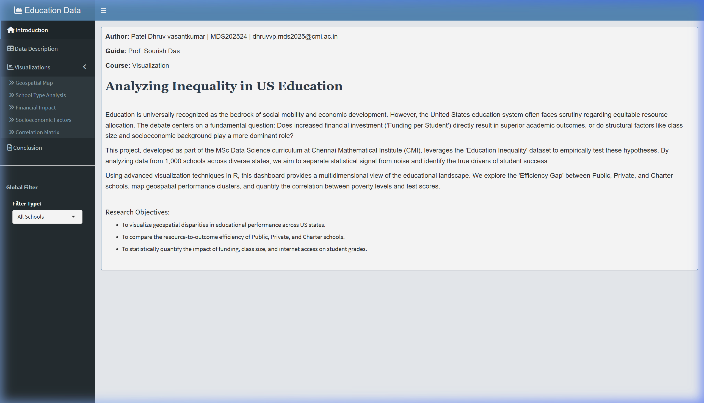
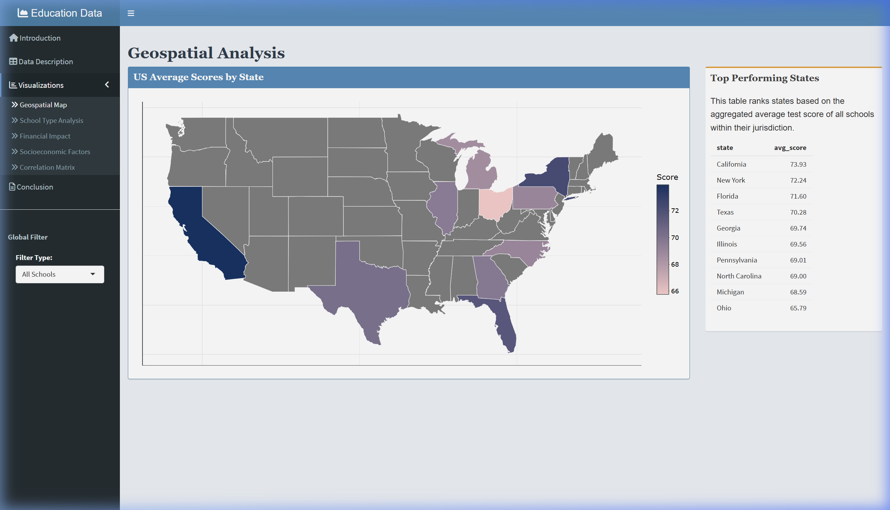
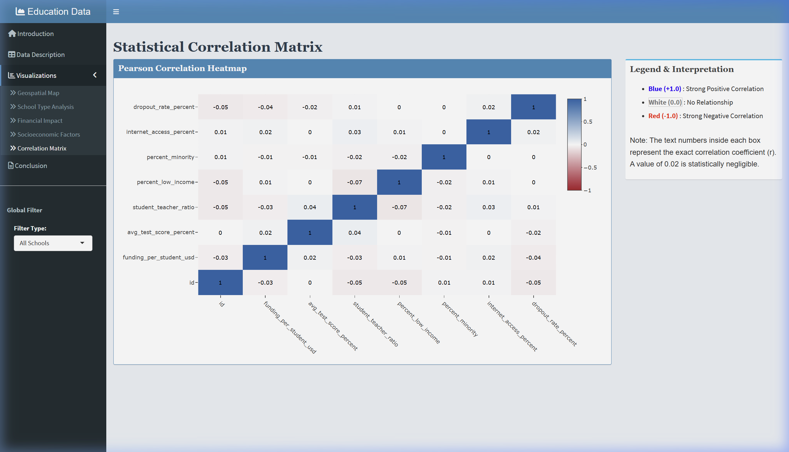

<div align="center">

# 📊 Education Inequality: Data Analysis Dashboard

### *Visualizing Hidden Trends in US School Funding & Performance*

[](https://www.r-project.org/)
[](https://shiny.posit.co/)
[](#)
[](#license)

**[🔗 Live Dashboard](https://dhruvvp.shinyapps.io/education-data-analysis/)**

---

</div>

## 🖼️ Dashboard Preview

<table>
  <tr>
    <td align="center"><strong>Introduction & Overview</strong></td>
    <td align="center"><strong>Geospatial Analysis</strong></td>
  </tr>
  <tr>
    <td></td>
    <td></td>
  </tr>
  <tr>
    <td align="center" colspan="2"><strong>Pearson Correlation Heatmap</strong></td>
  </tr>
  <tr>
    <td colspan="2" align="center"></td>
  </tr>
</table>

---

## 📋 Table of Contents

- [About the Project](#about-the-project)
- [Key Research Findings](#key-research-findings)
- [Dashboard Features](#dashboard-features)
- [Dataset](#dataset)
- [Tech Stack](#tech-stack)
- [Getting Started](#getting-started)
- [Project Structure](#project-structure)
- [Deployment](#deployment)
- [Author](#author)
- [Acknowledgements](#acknowledgements)
- [License](#license)

---

## 📖 About the Project

This interactive dashboard was developed as part of the **MSc Data Science (Visualization)** coursework at **Chennai Mathematical Institute (CMI)**. It investigates a fundamental question in education policy:

> *Does increased financial investment per student directly result in superior academic outcomes, or do structural factors like class size and socioeconomic background play a more dominant role?*

By analyzing data from **1,000 schools** across diverse US states, the dashboard uses advanced visualization techniques in R to separate statistical signal from noise and identify the true drivers of student success. The analysis covers geospatial performance mapping, school-type efficiency comparisons, and multivariate correlation studies.

---

## 🔬 Key Research Findings

| # | Finding | Detail |
|---|---------|--------|
| 1 | **Funding Inelasticity** | The regression slope between `funding_per_student_usd` and `avg_test_score_percent` is flat (~0.02 correlation) across all school types—simply increasing money without structural reform has negligible impact. |
| 2 | **The Private School Anomaly** | Private schools maintain a consistently higher median score and lower variance. They appear to have mechanisms that convert resources into academic gains more effectively. |
| 3 | **Weak Socioeconomic Signal** | `percent_low_income` showed a weaker-than-expected negative correlation with test scores. Some low-income schools successfully outperform expectations, indicating a high-variance environment. |
| 4 | **Simpson's Paradox** | The global correlation is ~0.02 (negligible), but the *conditional* correlation for Private schools is positive—a classic example of Simpson's Paradox. |

**Policy Implication:** Stakeholders should pivot from "Blanket Funding" strategies to **"Targeted Structural" interventions**—investments in reducing `student_teacher_ratio` and improving `internet_access_percent`.

---

## 🧩 Dashboard Features

The dashboard contains **7 interactive tab panels**, each targeting a specific analytical dimension:

### 1. 🏠 Introduction
Overview of the research problem, objectives, and methodology.

### 2. 📋 Data Description
A comprehensive data dictionary with attribute descriptions and a searchable, paginated **raw data explorer** (powered by `DT`).

### 3. 🗺️ Geospatial Map
An interactive **choropleth map** of the United States displaying average test scores by state, with a ranked table of top-performing states. Hover over any state to see its score.

### 4. 🏫 School Type Analysis
- **Pie Chart** — Proportion of Public, Private, and Charter schools
- **Histogram** — Overlaid frequency distribution of test scores by school type
- **Box Plot** — Statistical summary comparing median, quartiles, and outliers

### 5. 💰 Financial Impact
A scatter plot of `Funding per Student` vs. `Test Score` with **three distinct regression lines** (one per school type). The insight panel explains trend analysis and "Return on Investment" per type.

### 6. 📊 Socioeconomic Factors
- **Scatter Plot** — Low income percentage vs. test scores
- **Density Plot** — Distribution of dropout rates across school types

### 7. 🔢 Correlation Matrix
A full **Pearson correlation heatmap** with annotation numbers on each cell. A diverging red–white–blue color scale highlights positive, neutral, and negative correlations.

### 📝 Conclusion
A data-driven summary with three sections: Findings, Policy Implications, and Limitations & Future Scope.

### 🎚️ Global Filter
A sidebar filter allowing users to dynamically filter **all visualizations** by school type (All Schools / Public / Private / Charter).

---

## 📂 Dataset

| Property | Value |
|----------|-------|
| **File** | `education_inequality.csv` |
| **Records** | 1,000 schools |
| **Source** | Synthetic dataset for academic analysis |

### Data Dictionary

| Attribute | Type | Description |
|-----------|------|-------------|
| `id` | Integer | Unique identifier for each school |
| `school_name` | String | Name of the school |
| `state` | Categorical | US state where the school is located |
| `school_type` | Categorical | Public, Private, or Charter |
| `grade_level` | Categorical | Elementary, Middle, or High |
| `funding_per_student_usd` | Numeric | Annual funding per student (USD) |
| `avg_test_score_percent` | Numeric | Average student performance score (0–100%) |
| `student_teacher_ratio` | Numeric | Students per teacher |
| `percent_low_income` | Numeric | % students from low-income households |
| `percent_minority` | Numeric | % students from minority backgrounds |
| `internet_access_percent` | Numeric | % students with internet access at school |
| `dropout_rate_percent` | Numeric | Annual dropout rate (%) |

---

## 🛠️ Tech Stack

| Component | Technology |
|-----------|-----------|
| **Language** | R 4.x |
| **Framework** | [Shiny](https://shiny.posit.co/) + [shinydashboard](https://rstudio.github.io/shinydashboard/) |
| **Visualization** | [ggplot2](https://ggplot2.tidyverse.org/) + [plotly](https://plotly.com/r/) (interactive) |
| **Data Tables** | [DT](https://rstudio.github.io/DT/) |
| **Maps** | `maps` + `mapproj` packages |
| **Data Wrangling** | [tidyverse](https://www.tidyverse.org/) (dplyr, tidyr, etc.) |
| **Color Palettes** | [RColorBrewer](https://r-graph-gallery.com/38-rcolorbrewers-palettes.html) |
| **Deployment** | [shinyapps.io](https://www.shinyapps.io/) |

---

## 🚀 Getting Started

### Prerequisites

Make sure you have **R ≥ 4.0** and **RStudio** installed on your system.

- [Download R](https://cran.r-project.org/)
- [Download RStudio](https://posit.co/download/rstudio-desktop/)

### Installation

1. **Clone the repository**
   ```bash
   git clone https://github.com/<your-username>/education-data-analysis.git
   cd education-data-analysis
   ```

2. **Install required R packages**
   Open R or RStudio and run:
   ```r
   install.packages(c(
     "shiny",
     "shinydashboard",
     "tidyverse",
     "plotly",
     "DT",
     "RColorBrewer",
     "maps",
     "mapproj"
   ))
   ```

3. **Run the dashboard**
   ```r
   shiny::runApp("app.R")
   ```
   The dashboard will open in your default web browser at `http://127.0.0.1:XXXX`.

---

## 📁 Project Structure

```
education-data-analysis/
├── app.R                        # Main Shiny application (UI + Server)
├── education_inequality.csv     # Dataset (1,000 school records)
├── Visualisation.Rproj          # RStudio project file
├── screenshots/                 # Dashboard screenshots for README
│   ├── 01_introduction.png
│   ├── 02_geospatial_map.png
│   └── 03_correlation_matrix.png
├── .gitignore
└── README.md
```

---

## 🌐 Deployment

This dashboard is deployed on **shinyapps.io** and accessible at:

🔗 **https://dhruvvp.shinyapps.io/education-data-analysis/**

### To deploy your own copy:

1. Install the `rsconnect` package:
   ```r
   install.packages("rsconnect")
   ```

2. Configure your shinyapps.io account:
   ```r
   rsconnect::setAccountInfo(
     name   = "<your-account>",
     token  = "<your-token>",
     secret = "<your-secret>"
   )
   ```

3. Deploy:
   ```r
   rsconnect::deployApp()
   ```

---

## 👨‍💻 Author

**Patel Dhruv Vasantkumar**

| | |
|---|---|
| 🎓 **Program** | MSc Data Science, Chennai Mathematical Institute (CMI) |
| 🆔 **Roll No.** | MDS202524 |
| 📧 **Email** | dhruvvp.mds2025@cmi.ac.in |
| 📚 **Course** | Visualization |
| 👨‍🏫 **Guide** | Prof. Sourish Das |

---

## 🙏 Acknowledgements

- **Prof. Sourish Das** — Course instructor and project guide
- **Chennai Mathematical Institute (CMI)** — Academic institution
- [R Project](https://www.r-project.org/) and the [tidyverse](https://www.tidyverse.org/) ecosystem
- [shinyapps.io](https://www.shinyapps.io/) for free hosting

---

## 📄 License

This project is licensed under the **MIT License**. You are free to use, modify, and distribute this project with attribution.

```
MIT License

Copyright (c) 2025 Patel Dhruv Vasantkumar

Permission is hereby granted, free of charge, to any person obtaining a copy
of this software and associated documentation files (the "Software"), to deal
in the Software without restriction, including without limitation the rights
to use, copy, modify, merge, publish, distribute, sublicense, and/or sell
copies of the Software, and to permit persons to whom the Software is
furnished to do so, subject to the following conditions:

The above copyright notice and this permission notice shall be included in all
copies or substantial portions of the Software.

THE SOFTWARE IS PROVIDED "AS IS", WITHOUT WARRANTY OF ANY KIND, EXPRESS OR
IMPLIED, INCLUDING BUT NOT LIMITED TO THE WARRANTIES OF MERCHANTABILITY,
FITNESS FOR A PARTICULAR PURPOSE AND NONINFRINGEMENT.
```

---

<div align="center">

**⭐ If you find this project useful, consider giving it a star!**

*Built with ❤️ using R Shiny*

</div>
